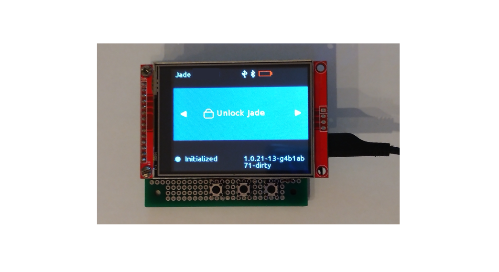
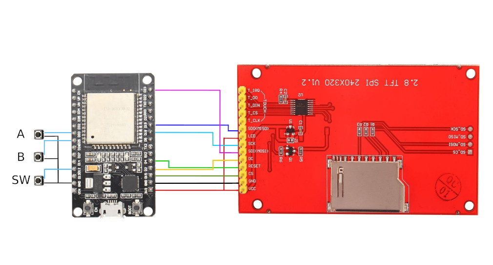
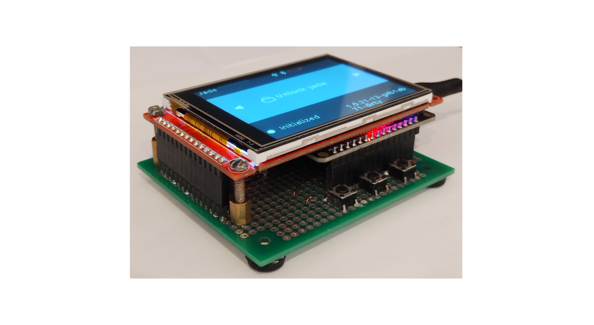

# DIY Jade ESP32 custom board device




#

## DIY Project requirements


*1. ESP-Wroom-32 DevKit V1 Micro-USB CP2102; VendorID=10c4, ProductID=ea60; ESP32-D0WDQ6 dual core Tensilica LX6 240 MHz, supports Secure Boot V2, 4MB SPIFlash*

*2. LCD 2.8" ILI9341 240x320 5V/3.3V SPI Display*

*3. Arduino 2.54 mm Straight Single Row Board Female 16-Pin Connector (THT) - 2pcs*

*4. Arduino 2.54 mm Straight Single Row Board Female 14-Pin Connector (THT)- 1pc*

*5. 2.54 mm Single Row Straight Round Female/Male Pin Header 14-Pin Connector (THT) - 1pc*

*6. 4-Pin Micro SPST Momentary Tact Button Switch OFF-(ON) 6 x 6 x 4.3 mm - 3pcs*

*7. 2.54 mm Double-Sided DIY Prototype Board PCB (76 x 66 mm) - 1pc*

*8. Enameled copper wire (0.5 mm)*

*and...*

*9. Some basic soldering skills*

#

## ESP32 and ILI9341 Display Assembly


## Connection diagram 



#

### DevKit Board Pins

| Pin Number DevKit board | Pin ILI9341 LCD Display |
| ------------------------- | ----------------------- |
| 3V3 | VCC and LED |
| GND | GND |
| D15 | CS |
| D2 | DC |
| D4 | RESET |
| D18 | SCK |
| D19 | (SDD) MISO |
| D23 | (SDI) MOSI |

#

### Input Buttons Pins

|  Pin Number DevKit board  |         Button          |
| ------------------------ | ----------------------- |
| GND | BTN "A", "B", "SW" |
| D35 | BTN "A" |
| D25 | BTN "B" |
| D12 | BTN "SW" |

###### _*Remark - With new Jade UI is possible to assembly this project with only two buttons, e.g. BTN "A" and BTN "SW"_

#



#
## Some minor code changes

### Enable full screen UI

```
CONFIG_GUI_DISPLAY_WINDOW_X1=0
CONFIG_GUI_DISPLAY_WINDOW_Y1=0
CONFIG_GUI_DISPLAY_WINDOW_X2=320
CONFIG_GUI_DISPLAY_WINDOW_Y2=240
```

#

## Project settings
### Defaults sdkconfig settings:
[Jade custom board](./sdkconfig_devkitv1_custom_board.defaults)

#

### Build project settings:
[Jade custom board build](./devkitv1_custom_board_Kconfig.projbuild)

