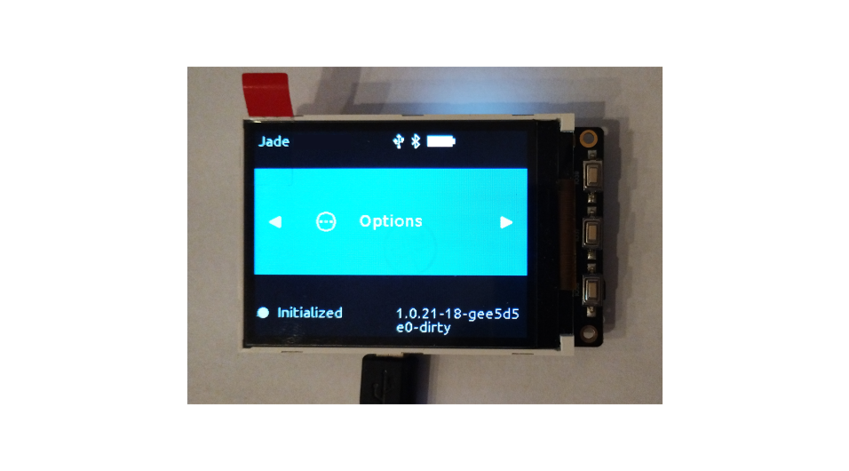

# DIY LILYGO TTGO T4 V1.3




#

## LILYGO TTGO T4 Specifications


*1. TTGO T4 V1.3 Micro-USB CH343; VendorID:1a86 ProductID:55d4 (same sa retail Jade);
ESP32-D0WDQ6 dual core Tensilica LX6, 240 MHz, supports Secure Boot V2, 4MB SPIFlash; 8MB PSRAM; battery;*

*2. LCD 2.4" ILI9341 240x320 Display*

#

### TTGO T4 Board Pins

| TTGO T4 Pins | ILI9341 LCD Display Pins |
| ------------------ | ----------------------- |
| 12 | MISO |
| 23 | MOSI |
| 18 | CKL |
| 27 | CS |
| 32 | DC |
| 5 | RST |
| 4 |  BCKL |

#

### Button Pins

| TTGO T4 Pin |  Button  |
| ----------- | --------- |
| IO39 | BTN "A" |
| IO37 | BTN "B" |
| IO38 | BTN "SW" |

#

## Some minor code changes

### Full screen UI

```display.c```

```
CONFIG_GUI_DISPLAY_WINDOW_X1=0
CONFIG_GUI_DISPLAY_WINDOW_Y1=0
CONFIG_GUI_DISPLAY_WINDOW_X2=320
CONFIG_GUI_DISPLAY_WINDOW_Y2=240 
```

#

### IOT buttons bluetooth workaround

TTGO T4 hw has three ```iot``` buttons (same as M5Stack-Basic/Fire boards) and A button behaves behaves badly when Bluetooth is active.

```input.c```

```
#if (!defined(CONFIG_BT_ENABLED)) || (!defined(CONFIG_BOARD_TYPE_TTGO_T4) && !defined(CONFIG_BOARD_TYPE_M5_BLACK_GRAY) && !defined(CONFIG_BOARD_TYPE_M5_FIRE))
```

###  Battery and voltage monitoring

```dashboard.c```

```
#elif defined(CONFIG_BOARD_TYPE_M5_BLACK_GRAY) || defined(CONFIG_BOARD_TYPE_M5_FIRE) || defined(CONFIG_BOARD_TYPE_TTGO_T4)
```

### IP5306 PMU

TTGO T4 hw has IP5306 power controller (same as M5Stack-Basic/Fire boards) :

```power.c```

```
#if defined(CONFIG_BOARD_TYPE_JADE) || defined(CONFIG_BOARD_TYPE_JADE_V1_1)                                            \
    || defined(CONFIG_BOARD_TYPE_M5_STICKC_PLUS) || defined(CONFIG_BOARD_TYPE_M5_BLACK_GRAY)                           \
    || defined(CONFIG_BOARD_TYPE_M5_FIRE) || defined(CONFIG_BOARD_TYPE_TTGO_T4)
```

and:

```
 #elif defined(CONFIG_BOARD_TYPE_M5_BLACK_GRAY)                                                                         \
    || defined(CONFIG_BOARD_TYPE_M5_FIRE) || defined(CONFIG_BOARD_TYPE_TTGO_T4)
```

## Project settings

### Sdkconfig settings:
[TTGO T4 defaults](./sdkconfig_lilygo_ttgo_t4.defaults)

#

### Build project settings:
[TTGO T4 project build](https://github.com/dark-thirty/Jade/blob/jade-diy-devkitv1/main/Kconfig.projbuild)

#

## Build project
 
### Ubuntu - Set up the environment:
Install Prerequisites:
To compile using ESP-IDF you will need to get the following packages:

```
sudo apt-get install git wget flex bison gperf python3 python3-venv cmake ninja-build ccache libffi-dev libssl-dev dfu-util libusb-1.0-0
```
#
LILYGO TTGO T4 device is at ```/dev/ttyACM0```. The currently logged user must be a member of ```dialout``` group.
#

Install esp-idf sdk.

More information is available in the [Espressif official guide](https://docs.espressif.com/projects/esp-idf/en/v5.0.2/esp32/get-started/index.html).

Get the esp-idf sdk and required tools:

```
cd ~/esp
git clone -b v5.0.2 --recursive https://github.com/espressif/esp-idf.git
cd ~/esp/esp-idf && git checkout 5181de8ac5ec5e18f04f634da8ce173b7ef5ab73 && ./install.sh esp32
```

### Build the firmware

Clone Jade repository:

```
git clone --recursive https://github.com/Blockstream/Jade.git $HOME/jade
cd $HOME/jade
```

### Set up the environmental variables

```
. $HOME/esp/esp-idf/export.sh
```

Copy an rename sdkconfig settings:

```
cp configs/sdkconfig_lilygo_ttgo_t4.defaults sdkconfig.defaults
idf.py build
```

If build is successful, flash onto the device:

```
idf.py -p /dev/ttyACM0 flash monitor
```
#

### Run some tests:

Initialize Jade hw, write down your recovery phrase, connect to the Blockstream Green app and finish setup process.

➡️    ***Write down your wallet ID, e.g. ```BXXXXXXA```***

#

Reset device.

Restore wallet with recovery phrase, connect to the Blockstream Green app and finish setup process. 
If everything is ok, you should have the same wallet ID:   ➡️ ***e.g. ```BXXXXXXA```***

### OTA (Over The Air) Updates

The OTA update mechanism allows a device to update itself based on data received while the normal firmware is running.
This is most important test, because when Secure Boot is enabled it is only way to upgrade Jade firmware.

**⚠️ Before perform OTA Update, TURN OFF Bluetooth ⚠️**

Оnce the device is flashed you just need to build Jade app:

```
cd $HOME/jade

. $HOME/esp/esp-idf/export.sh

idf.py app
```

After build is complete, run:

```
python jade_ota.py --noagent --skipble --serialport /dev/ttyACM0
```
